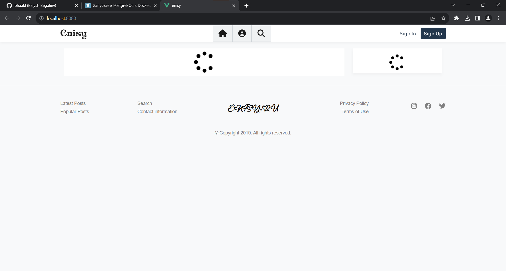
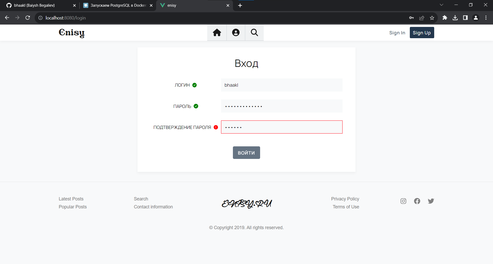
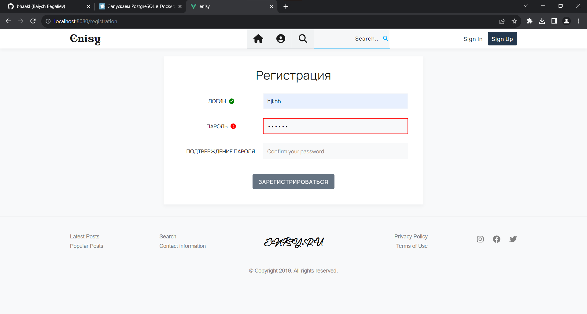

# Enisy
Репозиторя является Frontend(Client) частью клиент-серверного приложения Enisy.
Проект создан для развлекательных, учебных целей. Предназначен для тематики выкладывания статьей и их обсуждения. Сейчас находится на стадии разработки(временами добавляюю, удаляю что-то, для практики полезно).

## Технологии
- [JavaScript](https://www.ecma-international.org/publications-and-standards/standards/ecma-262/)
- [Vue.js](https://www.vuejs.org/)
- [Vue Router](https://router.vuejs.org/)
- [Scss](https://sass-scss.ru/)

## Структура
Состоит из Главной страницы

страниц для Входа
 
Регистрации
 
